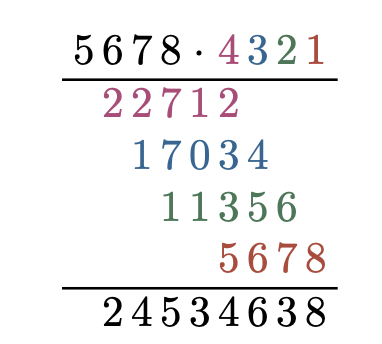
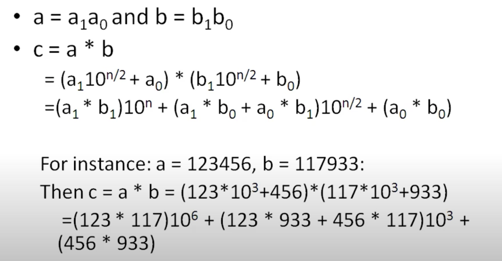
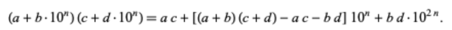
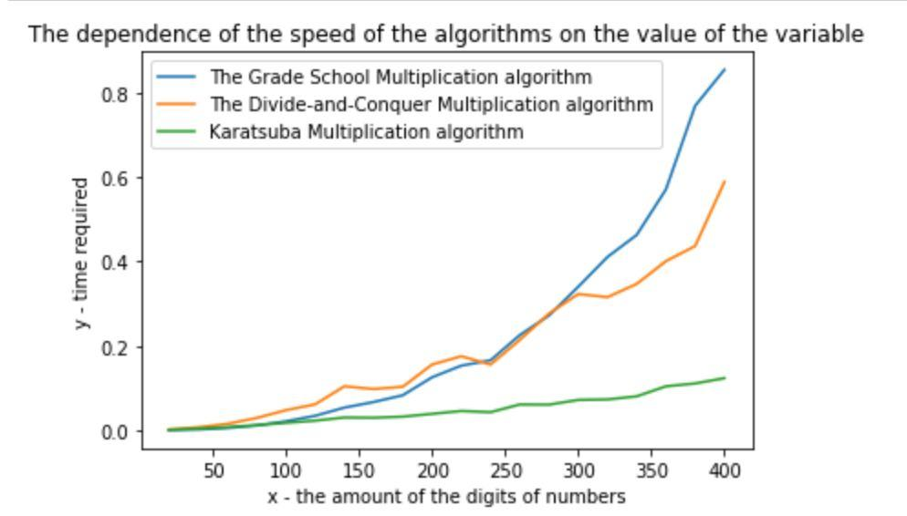

# Multiplication algorithms

This repository contains the implementation of 3 different multiplication algorithms:

- Grade School Multiplication
- Divide-and-Conquer Multiplication
- Karatsuba Multiplication 

## Table of content
1. [Grade School Multiplication Algorithm](#Grade-School-Multiplication-Algorithm)
2. [Divide-and-Conquer Multiplication](#Divide-and-Conquer-Multiplication)
3. [Karatsuba Multiplication](#Karatsuba-Multiplication)
4. [Data type](#Data-type)
5. [Multiplicator class](#Multiplicator-class)
6. [Testing](#Testing)
7. [Results](#Results)


## Grade School Multiplication Algorithm

The basic idea of this algorithm is to multiply the multiplicand by each digit of the multiplier and then add up all the properly shifted results. It's complexity is O(n^2), where n is the maximum number of digits among two numbers.


## Divide-and-Conquer Multiplication

This approach leads to better complexity due to decomposition of large numbers multiplication problem into subproblems of two-digit multiplications. 




## Karatsuba Multiplication

The key feature of Karatsuba's method lies in the observation that two-digit multiplication can be done with only three rather than the four multiplications classically required. Here, the running time reduces to O(n^1.59), what gives a huge difference for big values of n.



## Data type

In order to represent an integer with a large number of digits, a custom class called "Number" was created. This class is equipped with all necessary semantics that encapsulate referencing to individual components of a number (such as a digit), performing primitive operations (such as splitting, adding two numbers, etc.).

```cpp
struct Num {
  ...
  Short size; //represents the number of digits
  std::string base;
}
```

To multiply numbers with different number of digits this class contains the function of adding zeroes to a certain place of the number.

```cpp
void Num::addZeros(Short r, Short l) {
    while (r < l) {  //r stands for the size of a number with less digits
        this->setDigit(r, 0);
        ++r;
    }
}
```

## Multiplicator class

The class allows to calculate the product of two (perhaps large) integers using the algorithms described above. 

```cpp
class Multiplicator {
  ...
  static Num gradeSchoolMultiplication(const Num& n1, const Num& n2);
  static Num divideAndConquer(const Num& n1, const Num& n2);
  static Num karatsubaAlgorithm(const Num& n1, const Num& n2);
}
```

It also has a method that generates a random number of k-digits.

```cpp
Num Multiplicator::createNumber(Short k) {
    std::random_device rd;
    std::mt19937 gen(rd());
    std::string a;
    if (k == 1) {
        std::uniform_int_distribution<> d2(0, 9);
        a.push_back(static_cast<char>(48 + d2(gen)));
    }
    else {
        std::uniform_int_distribution<> d1(1, 9);
        std::uniform_int_distribution<> d2(0, 9);
        for (int i = 0; i < k - 1; ++i) {
            a.push_back(static_cast<char>(48 + d2(gen)));
        }
        a.push_back(static_cast<char>(48 + d1(gen)));
    }
    Num number(a, k);
    return number;
}
```

## Testing

Testing is performed by several calls of the ```createNumber()``` function for a different number of digits with average time computation. The average time is then stored in ```.csv``` file for later use in graph construction.

## Results 

The graph plotted in Matplotlib shows the running time difference. 


